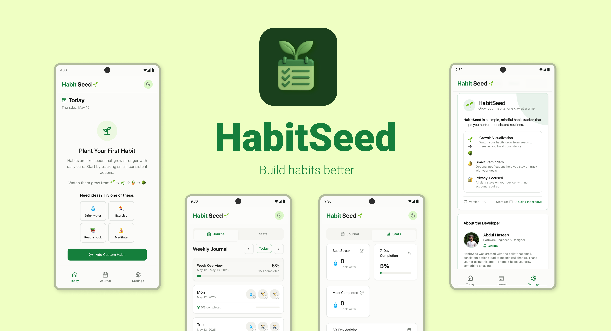

# 🌱 HabitSeed

<div align="center">
  
  <h3>Build better habits, one seed at a time</h3>
  
  [](https://github.com/haseebno1/HabitSeed/actions/workflows/build.yml)
  
  [](https://opensource.org/licenses/MIT)
  [](https://github.com/haseebno1/HabitSeed/issues)
</div>

HabitSeed is a beautiful, intuitive habit tracking app designed to help you build consistent routines—one day at a time. With a focus on simplicity and meaningful visual feedback, HabitSeed helps you cultivate positive habits that grow with consistency.

## ✨ Features

- 📝 Create and track daily, weekly, and monthly habits with custom templates
- 🔄 Track streaks and visualize your consistency with beautiful growth-themed UI
- 🌓 Dark/light theme to match your preferences
- 💾 Private and secure - all data stays on your device
- 📱 Works on web and Android
- 🚫 No account required - get started in seconds
- 🎯 Multiple tracking types: checkbox, quantity, and duration
- 📊 Statistics to monitor your habit consistency

## 🖥️ Screenshots

<div align="center">
  <p>
    
  </p>
</div>

## 🚀 Getting Started

### Prerequisites

- Node.js (v20+)
- npm or yarn
- For Android builds:
  - Android Studio
  - JDK 11+
  - Android SDK

### Installation

1. Clone the repository:
```bash
git clone https://github.com/haseebno1/HabitSeed.git
cd HabitSeed
```

2. Install dependencies:
```bash
npm install
```

3. Start the development server:
```bash
npm run dev
```

Visit `http://localhost:5173` in your browser to start using the app.

### Building for Production

To build the web application:

```bash
npm run build
```

The built files will be in the `dist` directory and can be deployed to any static hosting service.

## 📱 Mobile Development

### Setting Up for Android

1. Build the web app and set up Android platform:
```bash
npm run build
npx cap add android
npx cap sync android
```

2. Open in Android Studio:
```bash
npx cap open android
```

3. Run on a device or emulator through Android Studio

### Automated Builds

HabitSeed uses GitHub Actions to automate both web and Android builds:

- Every push to `main` and pull request triggers a build workflow
- Web artifacts are built and stored as GitHub artifacts
- Android APK is automatically built and available as an artifact
- Download the latest build artifacts from the Actions tab in the GitHub repository

### Live Development for Android

For faster development with live-reload:

```bash
npm run dev
npx cap run android
```

This will start a development server and open the app on your connected Android device with live reload enabled.

## 🛠️ Tech Stack

- React 18 with TypeScript
- Vite for fast builds and development
- TailwindCSS with shadcn/ui components
- Lucide for beautiful icons
- IndexedDB for robust data storage
- Capacitor for mobile platform compatibility

## 📂 Project Structure

```
HabitSeed/
├── src/
│   ├── components/       # UI components (HabitButton, HabitList, etc.)
│   ├── hooks/            # Custom React hooks (useHabits, useSettings)
│   ├── lib/              # Utilities and services (storage, haptics)
│   ├── pages/            # App pages (Index, Journal, Settings)
│   └── App.tsx           # Main component with routing
├── public/               # Static assets
├── android/              # Android platform code
├── index.html            # Entry HTML file
├── package.json          # Dependencies and scripts
└── vite.config.ts        # Vite configuration
```

## 💾 Data Privacy

HabitSeed stores all your data locally:

- Uses IndexedDB for primary storage
- Provides localStorage fallback for older browsers
- Ensures your habit data remains private and secure
- Enables data backup and restore via JSON export/import

## 🤝 Contributing

Contributions are welcome! Please check out our [Contributing Guide](CONTRIBUTING.md) for details on:

- How to set up the development environment
- The submission process for pull requests
- Our code of conduct

## 📄 License

This project is licensed under the MIT License - see the [LICENSE](LICENSE) file for details.

## 🔒 Security

For information about our security practices and how to report security issues, please see our [Security Policy](SECURITY.md).

## 👏 Acknowledgments

- Built with [shadcn/ui](https://ui.shadcn.com/) components
- Icons from [Lucide Icons](https://lucide.dev/)
- Storage implementations inspired by [Capacitor Storage](https://capacitorjs.com/docs/apis/storage)

## 📬 Contact & Support

- Report bugs or request features through [GitHub Issues](https://github.com/haseebno1/HabitSeed/issues)
- Follow updates and announcements on [Twitter](#)

---

<div align="center">
  <p>Made with ❤️ by <a href="https://github.com/haseebno1">haseebno1</a></p>
  <p>
    <a href="https://github.com/haseebno1/HabitSeed/stargazers">⭐ Star us on GitHub</a> •
    <a href="https://github.com/haseebno1/HabitSeed/issues">🐛 Report a bug</a> •
    <a href="https://github.com/haseebno1/HabitSeed/discussions">💬 Discussions</a>
  </p>
</div>
